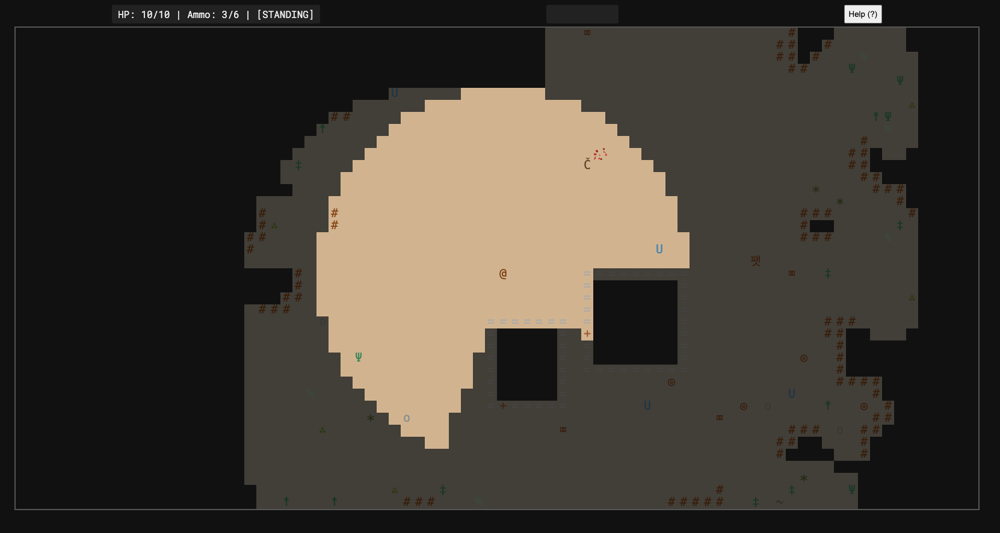

# [Destrier](https://mostlymaths.net/destrier)

[Github](https://github.com/rberenguel/destrier)
[Play](https://mostlymaths.net/destrier)
[Itch.io](https://rberenguel.itch.io/destrier)

This is a _roguelike wave shooter_.

Your goal is to survive 20 waves… and then keep going.

#game
#browser
#pwa

# [obsidian-fsrs-plugin]()

[Github](https://github.com/rberenguel/obsidian-fsrs-plugin)

A simple plugin for Obsidian using the FSRS (Free Spaced Repetition Scheduler) algorithm. Turn your notes into flashcards and review them directly within Obsidian.

#obsidian

# [obsidian-clau-plugin]()

[Github](https://github.com/rberenguel/obsidian-clau-plugin)

A quick switcher plugin for Obsidian with fuzzy search across all your notes.

#obsidian

# [Best Before]()

[Github](https://github.com/rberenguel/bestBefore)

Assign an expiry date to each browser tab; the extension will automatically close them to prevent clutter and keep your workspace tidy.

#chrome-extension

# [Salta]()

[Github](https://github.com/rberenguel/salta)
[Video](https://www.youtube.com/watch?v=Y5DxPO1nzjE)

A Chrome extension to visually jump across tabs. I wanted to see if I could do it with my current Chrome extension knowledge.

#chrome-extension

# [NT]()

[Github](https://github.com/rberenguel/nt)
[Demo (as web)](https://mostlymaths.net/nt)

A very customizable _new tab_ extension for Chrome.

#chrome-extension

# [obsidian-mirall-plugin]()

[Github](https://github.com/rberenguel/obsidian-mirall-plugin)

Mirall is an Obsidian plugin designed to streamline the process of linking scattered notes and ideas back to a central page. It allows you to quickly tag lines in any note and aggregate them as transclusions in a designated file, keeping your context organized and accessible.

#obsidian

# [obsidian-escoli-plugin]()

[Github](https://github.com/rberenguel/obsidian-escoli-plugin)

Escoli enhances Obsidian's editor by turning a specific subset of your footnotes into a dynamic system for side notes.

#obsidian

# [soma]()

[Github](https://github.com/rberenguel/soma)
[Play](https://mostlymaths.net/soma)

A Three.js version of the classic Soma cube puzzle.

Additional puzzles to build with the same pieces are available.

#browser
#game
#pwa
#mobile

# [Mots]()

[Github](https://github.com/rberenguel/mots)
[Play](https://mostlymaths.net/mots)

Find words, score points.

Mots is designed to be a quick game you can pick up, play for 5 minutes, and put down—ideal for short daily pauses. Or for binging, but I tried to keep it a light game where you don't need to plan much ahead.

#browser
#game
#pwa
#mobile
#STAr

# [blckt]()

[Github](https://github.com/rberenguel/blckt)
[Play](https://mostlymaths.net/blckt)

A Blockout (3d "Tetris") like-game built with Three.js

#browser
#game
#pwa
#mobile

# [Foragits]()

[Github](https://github.com/rberenguel/foragits)
[Play](https://mostlymaths.net/foragits)

A simple, turn-based roguelike prototype with a Western theme, built in JavaScript with rotjs.

#wip
#browser
#game
#pwa

---

# [obsidian-preso-plugin]()

[Github](https://github.com/rberenguel/obsidian-preso-plugin)
[Demo (JS)](https://www.mostlymaths.net/obsidian-preso-plugin/examples/Preso.html)
[Demo (No JS)](https://www.mostlymaths.net/obsidian-preso-plugin/examples/Preso.css-only.html)

Preso is a plugin for creating and previewing presentations directly within Obsidian. It provides a live, in-editor preview of your slides, allowing for a fast and fluid content creation workflow.

#obsidian

# [obsidian-roba-estesa-plugin]()

[Github](https://github.com/rberenguel/obsidian-roba-estesa-plugin)

An Obsidian plugin to enhance user privacy through transient obfuscation and granular content redaction. Ideal for screen sharing, presentations, or working in public spaces where you want to selectively hide parts of your notes.

#obsidian
#wip

# [obsidian-snipper-plugin]()

[Github](https://github.com/rberenguel/obsidian-snipper-plugin)

A simple plugin for Obsidian to embed a daily, editable snippet into your notes. It helps you maintain atomic notes by storing the snippet content in a separate file, while still allowing for seamless, in-place editing.

#obsidian

# [mikado]()

[Github](https://github.com/rberenguel/mikado)
[Play](https://mostlymaths.net/mikado)

This project is a web-based brain training game designed to test and improve 3D spatial reasoning skills. It was developed collaboratively to explore procedural generation of complex visual puzzles.

#browser
#game
#pwa
#mobile

# [obsidian-ergodic-plugin]()

[Github](https://github.com/rberenguel/obsidian-ergodic-plugin)

Ergodic, an Obsidian plugin designed to help you rediscover your notes by opening a random one from your vault. Opens a random note, with options to exclude paths/tags and auto-jump to the next note.

#obsidian

# [Clauer]()

[Github](https://github.com/rberenguel/clauer)
[Play](https://mostlymaths.net/clauer)

A simple implementation of the Symbol Digit Modalities Test (SDMT), but slightly stylish.

#browser
#game
#pwa
#mobile
#wip

# [nb]()

[Github](https://github.com/rberenguel/nb)
[Play](https://mostlymaths.net/nb)

A simple PWA for the n-back task, visual-only (I'm exploring audio for quadruple n-back, but that's still WIP). Has dual and triple modes.

#browser
#game
#pwa
#mobile

# [Gofre]()

[Github](https://github.com/rberenguel/gofre)
[Play](https://mostlymaths.net/gofre)

A variation on the Stroop selective attention test made with Gemini.

#browser
#game
#pwa
#mobile
#wip

# [Rotator]()

[Github](https://github.com/rberenguel/rotator)
[Play](https://mostlymaths.net/rotator)

A fork from https://github.com/0xf00ff00f Match pairs of rotating shapes.

#browser
#game
#pwa
#mobile

# [mussol]()

[Github](https://github.com/rberenguel/mussol)
[Play](https://mostlymaths.net/mussol)

Analogy quiz based on the Analogy Question Dataset (CC-BY-NC-4.0). Answering can be tricky, since some of the analogies (particularly in the conceptnet dataset I think) are weird.

#browser
#game
#pwa
#mobile
#wip

# [Apoquerar]()

[Github](https://github.com/rberenguel/apoquerar)
[Play](https://mostlymaths.net/apoquerar)

A version of Zach Gage's Pile up Poker (that you can play in Puzzmo). This is a simplified version I can play "locally".

#browser
#game
#pwa
#mobile

# [Pinta]()

[Github](https://github.com/rberenguel/pinta)
[Use](https://mostlymaths.net/pinta)
[Example export](https://rberenguel.github.io/pintes/Slicer-whitepaper.html)
[Video](https://www.youtube.com/watch?v=KDMp6_hqPv0)

Outline editor, written by me and Gemini.

#browser
#pwa

# [Suc]()

[Github](https://github.com/rberenguel/suc)
[Video](https://github.com/rberenguel/suc?tab=readme-ov-file#suc)

Make work less boring.

Explosions on marking as read / archiving in GMail.

Distraction-free blocking of pages, with score. Triple click on the distraction free overlay to remove it.

#chrome-extension

# [Goita]()

[Github](https://github.com/rberenguel/goita)
[Use](https://mostlymaths.net/goita/pwa/)
[Video](https://www.youtube.com/watch?v=Q2RcpPYaHbs)

A Chrome extension to take and annotate screenshots and memes.

Can be used as a standalone PWA, too.

#chrome-extension
#pwa
#browser
#wip

# [Mos]()

[Github](https://github.com/rberenguel/mos)
[Use](https://mostlymaths.net/mos)

Pixel art editor

#browser
#pwa
#wip

# [sis]()

[Github](https://github.com/rberenguel/sis)
[Play](https://mostlymaths.net/sis)

Given a dice and several potential cube unfoldings, match the right one.

#browser
#game
#pwa
#mobile

# [Garbuix]()

[Github](https://github.com/rberenguel/garbuix)
[Use](https://mostlymaths.net/garbuix)

A live editor for a graphviz-like language (transpiles to dot on the fly), designed to make writing graphs by hand somewhat enjoyable. I use it when drawing concept maps.

#pwa
#browser

# [Shotgun Pollock]()

[Github](https://github.com/rberenguel/shotgun-pollock)
[Play](https://mostlymaths.net/shotgun-pollock)

I got an idea for a game, and realised Global Game Jam 25 was going to start in 2 days. The theme this year is "Bubbles"… which almost fits the idea I had.

_Paint blobs have invaded the canvas. But you have your shotgun_.

#browser
#game
#pwa
#mobile

# [foowrite]()

[Github](https://github.com/rberenguel/foowrite)
[Video](https://www.youtube.com/watch?v=FT0cgbyiSng)

A distraction-free writing device you can take with you anywhere (as long as you have a Pi Pico with the right screen or want to write a bit of C++). With vim keybindings.

#pico
