# [Destrier](https://mostlymaths.net/destrier)

[Github](https://github.com/rberenguel/destrier)
[Play](https://mostlymaths.net/destrier)
[Itch.io](https://rberenguel.itch.io/destrier)

This is a _roguelike wave shooter_.

Your goal is to survive 20 waves… and then keep going.

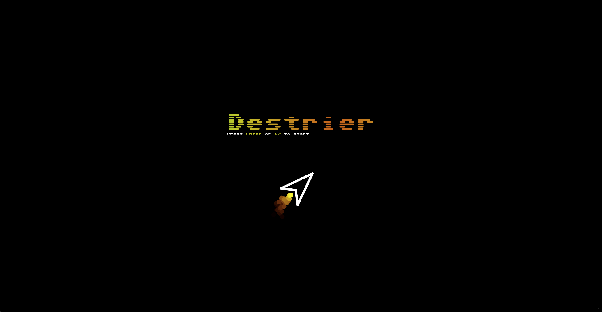

#game
#pwa
#star
#202503

# [obsidian-fsrs-plugin]()

[Github](https://github.com/rberenguel/obsidian-fsrs-plugin)

A simple plugin for Obsidian using the FSRS (Free Spaced Repetition Scheduler) algorithm. Turn your notes into flashcards and review them directly within Obsidian.

#obsidian
#202505

# [obsidian-clau-plugin]()

[Github](https://github.com/rberenguel/obsidian-clau-plugin)

A quick switcher plugin for Obsidian with fuzzy search across all your notes.

#obsidian
#202507

# [Best Before]()

[Github](https://github.com/rberenguel/bestBefore)

Assign an expiry date to each browser tab; the extension will automatically close them to prevent clutter and keep your workspace tidy.

#chrome-extension
#202402

# [Salta]()

[Github](https://github.com/rberenguel/salta)
[Video](https://www.youtube.com/watch?v=Y5DxPO1nzjE)

A Chrome extension to visually jump across tabs. I wanted to see if I could do it with my current Chrome extension knowledge.

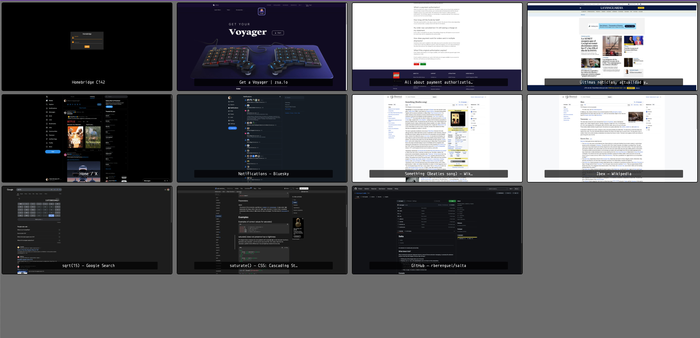

#chrome-extension
#202411

# [NT]()

[Github](https://github.com/rberenguel/nt)
[Demo (as web)](https://mostlymaths.net/nt)

A very customizable _new tab_ extension for Chrome.

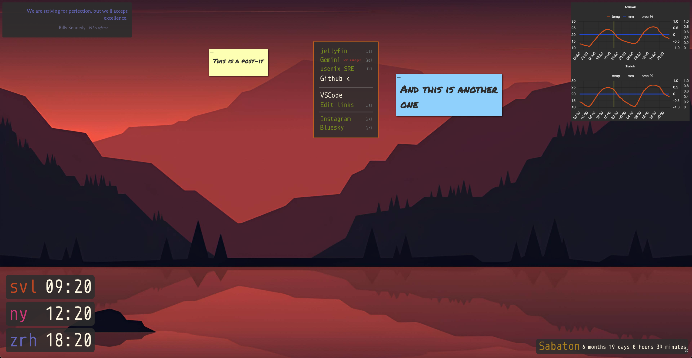

#chrome-extension
#202409

# [obsidian-mirall-plugin]()

[Github](https://github.com/rberenguel/obsidian-mirall-plugin)

Mirall is an Obsidian plugin designed to streamline the process of linking scattered notes and ideas back to a central page. It allows you to quickly tag lines in any note and aggregate them as transclusions in a designated file, keeping your context organized and accessible.

#obsidian
#202507

# [obsidian-escoli-plugin]()

[Github](https://github.com/rberenguel/obsidian-escoli-plugin)

Escoli enhances Obsidian's editor by turning a specific subset of your footnotes into a dynamic system for side notes.

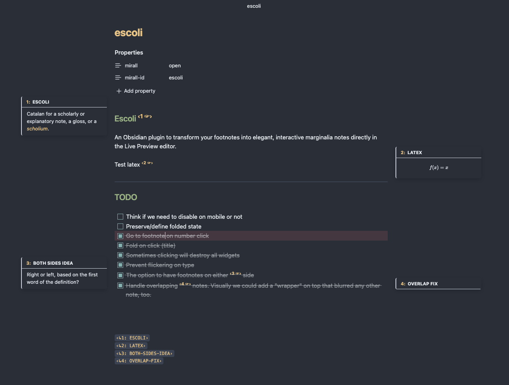

#obsidian
#202508

# [soma]()

[Github](https://github.com/rberenguel/soma)
[Play](https://mostlymaths.net/soma)

A Three.js version of the classic Soma cube puzzle.

Additional puzzles to build with the same pieces are available.

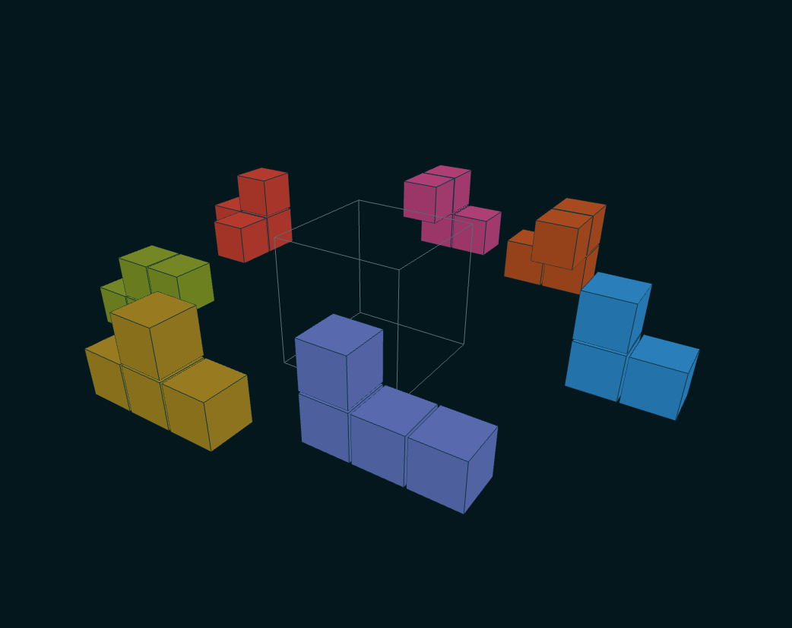

#game
#pwa
#mobile
#202507

# [Mots]()

[Github](https://github.com/rberenguel/mots)
[Play](https://mostlymaths.net/mots)

Find words, score points.

Mots is designed to be a quick game you can pick up, play for 5 minutes, and put down—ideal for short daily pauses. Or for binging, but I tried to keep it a light game where you don't need to plan much ahead.

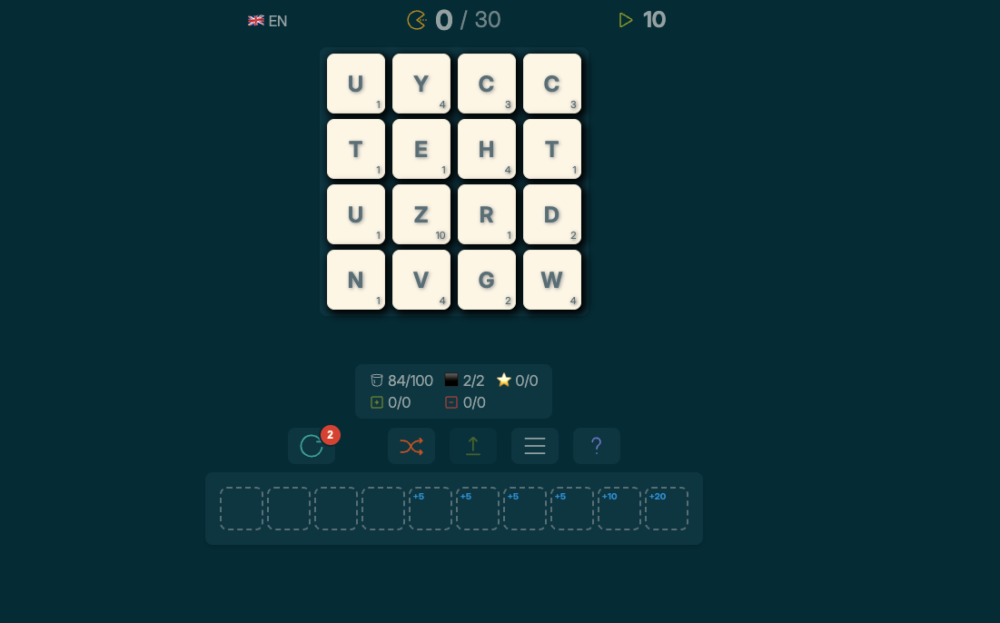

#game
#pwa
#mobile
#star
#202506

# [blckt]()

[Github](https://github.com/rberenguel/blckt)
[Play](https://mostlymaths.net/blckt)

A Blockout (3d "Tetris") like-game built with Three.js

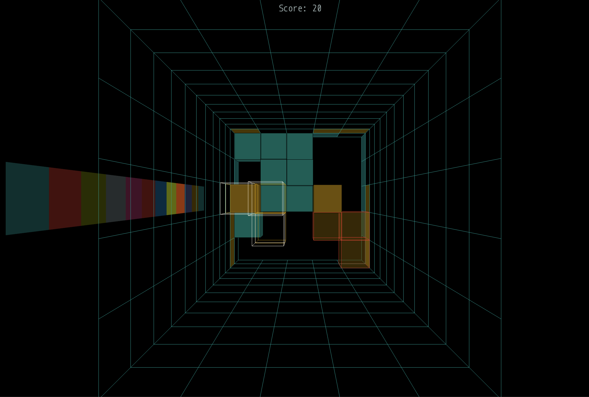

#game
#pwa
#mobile
#202507

# [Foragits]()

[Github](https://github.com/rberenguel/foragits)
[Play](https://mostlymaths.net/foragits)

A simple, turn-based roguelike prototype with a Western theme, built in JavaScript with rotjs.

#wip
#game
#pwa
#202507

# [obsidian-preso-plugin]()

[Github](https://github.com/rberenguel/obsidian-preso-plugin)
[Demo (JS)](https://www.mostlymaths.net/obsidian-preso-plugin/examples/Preso.html)
[Demo (No JS)](https://www.mostlymaths.net/obsidian-preso-plugin/examples/Preso.css-only.html)

Preso is a plugin for creating and previewing presentations directly within Obsidian. It provides a live, in-editor preview of your slides, allowing for a fast and fluid content creation workflow.

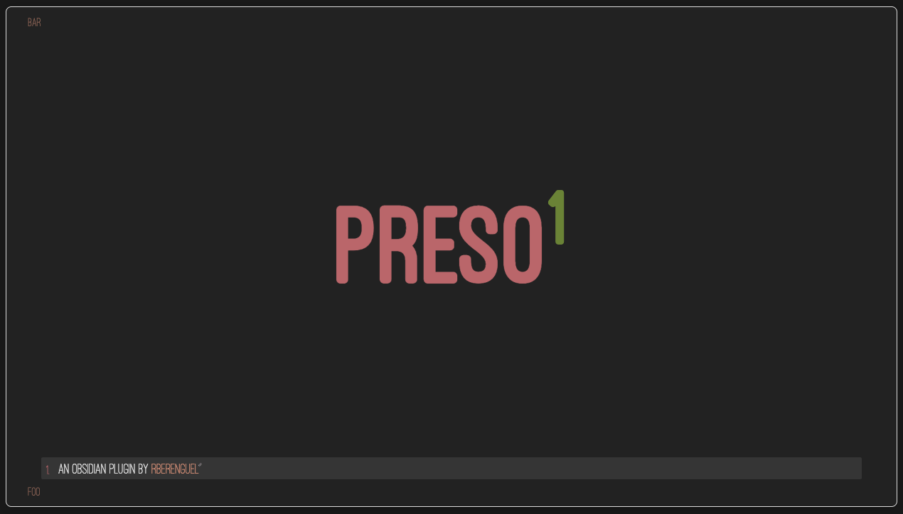

#obsidian
#202507

# [obsidian-roba-estesa-plugin]()

[Github](https://github.com/rberenguel/obsidian-roba-estesa-plugin)

An Obsidian plugin to enhance user privacy through transient obfuscation and granular content redaction. Ideal for screen sharing, presentations, or working in public spaces where you want to selectively hide parts of your notes.

#obsidian
#wip
#202507

# [obsidian-snipper-plugin]()

[Github](https://github.com/rberenguel/obsidian-snipper-plugin)

A simple plugin for Obsidian to embed a daily, editable snippet into your notes. It helps you maintain atomic notes by storing the snippet content in a separate file, while still allowing for seamless, in-place editing.

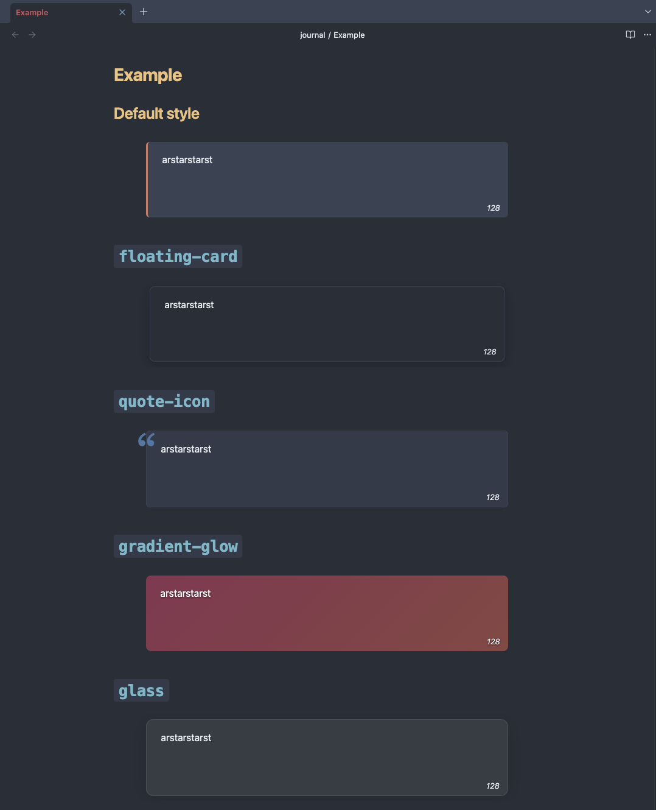

#obsidian
#202506

# [mikado]()

[Github](https://github.com/rberenguel/mikado)
[Play](https://mostlymaths.net/mikado)

This project is a web-based brain training game designed to test and improve 3D spatial reasoning skills. It was developed collaboratively to explore procedural generation of complex visual puzzles.

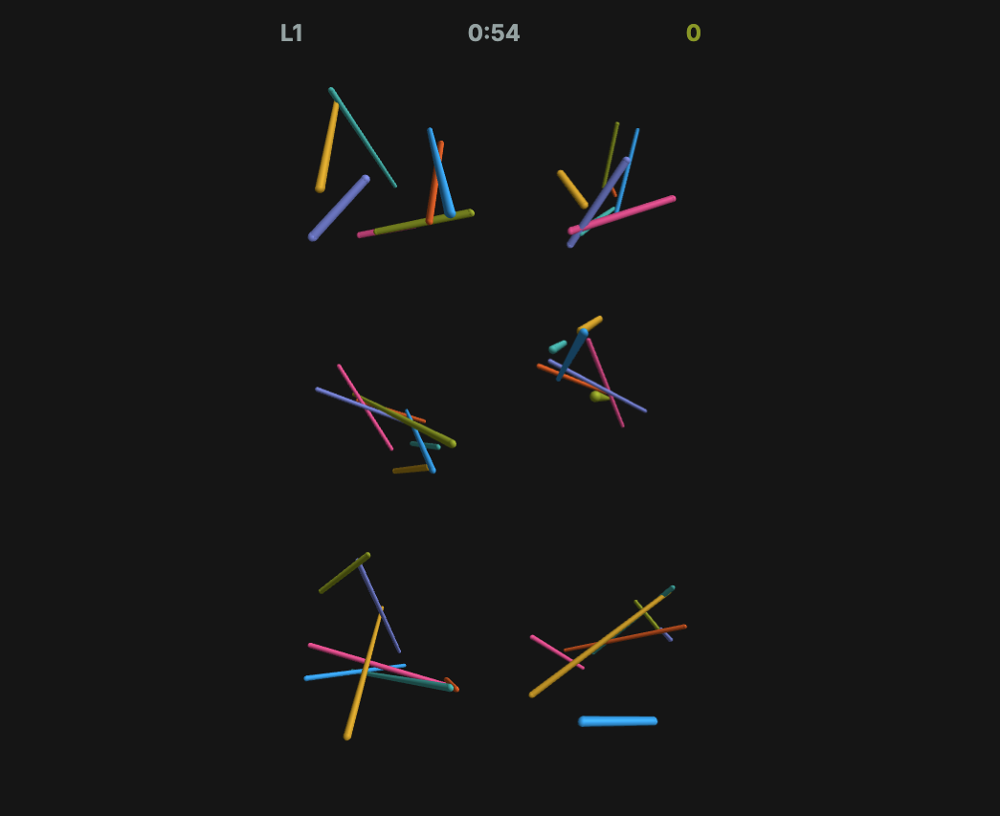

#game
#pwa
#mobile
#202507

# [obsidian-ergodic-plugin]()

[Github](https://github.com/rberenguel/obsidian-ergodic-plugin)

Ergodic, an Obsidian plugin designed to help you rediscover your notes by opening a random one from your vault. Opens a random note, with options to exclude paths/tags and auto-jump to the next note.

#obsidian
#202507

# [Clauer]()

[Github](https://github.com/rberenguel/clauer)
[Play](https://mostlymaths.net/clauer)

A simple implementation of the Symbol Digit Modalities Test (SDMT), but slightly stylish.

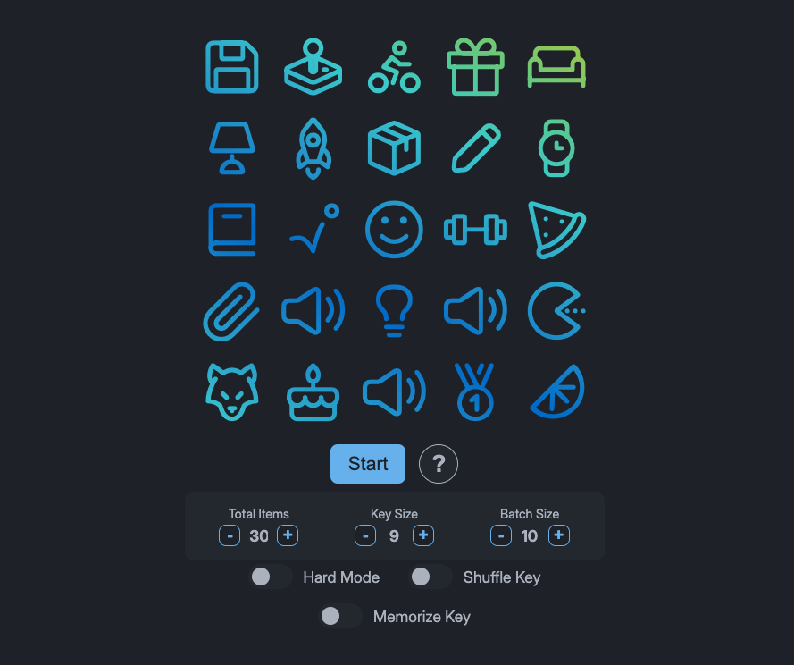

#game
#pwa
#mobile
#202506

# [nb]()

[Github](https://github.com/rberenguel/nb)
[Play](https://mostlymaths.net/nb)

A simple PWA for the n-back task, visual-only (I'm exploring audio for quadruple n-back, but that's still WIP). Has dual and triple modes.

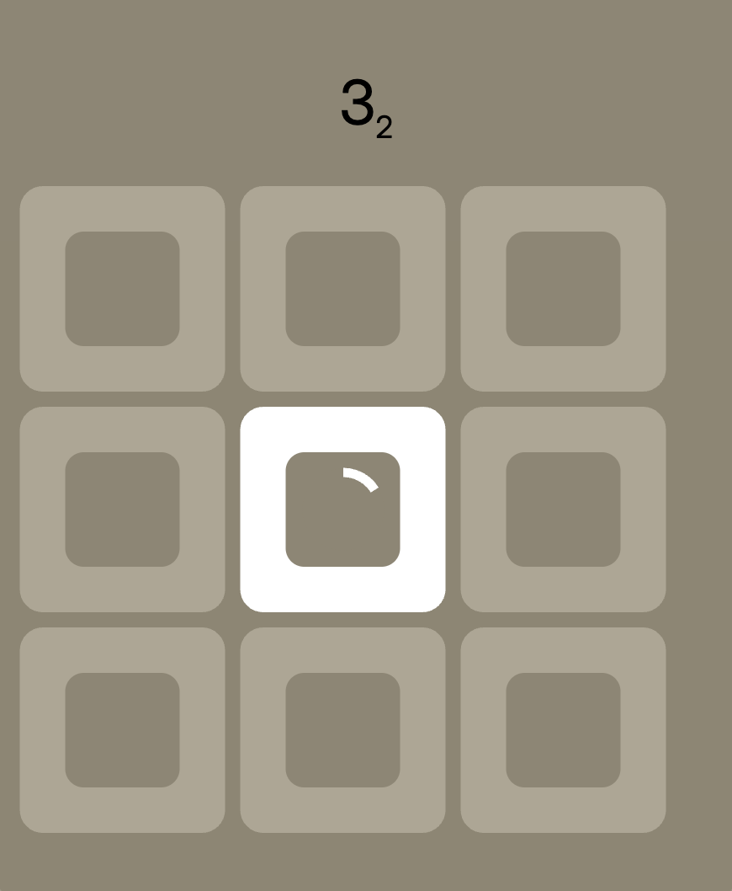

#game
#pwa
#mobile
#202407

# [Gofre]()

[Github](https://github.com/rberenguel/gofre)
[Play](https://mostlymaths.net/gofre)

A variation on the Stroop selective attention test made with Gemini.

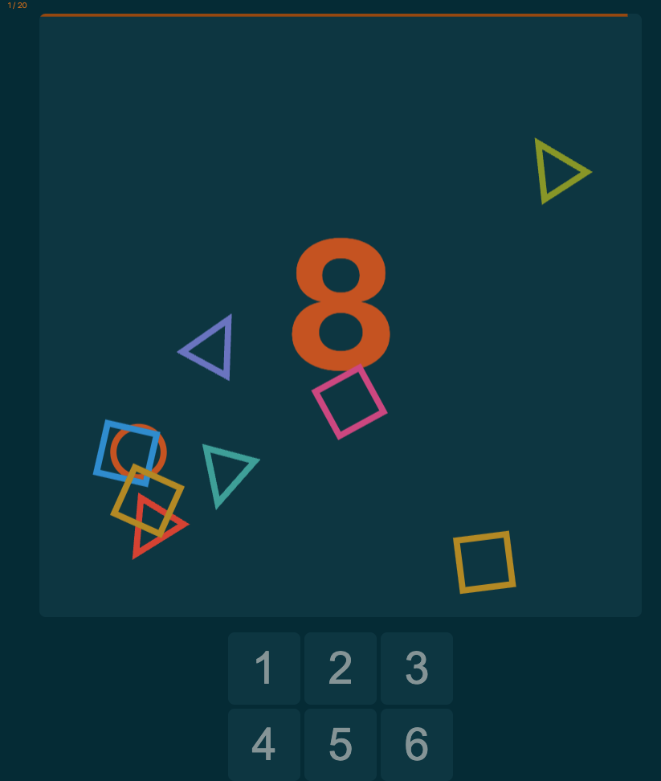

#game
#pwa
#mobile
#202506

# [Rotator]()

[Github](https://github.com/rberenguel/rotator)
[Play](https://mostlymaths.net/rotator)

A fork from https://github.com/0xf00ff00f Match pairs of rotating shapes.

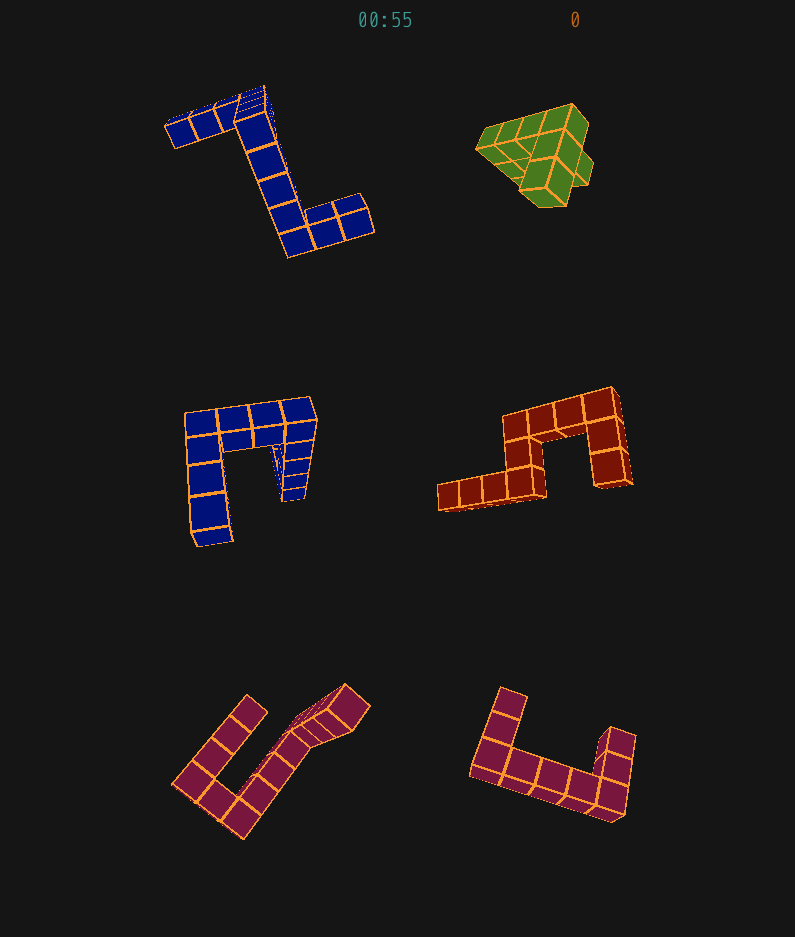

#game
#pwa
#mobile
#202505

# [mussol]()

[Github](https://github.com/rberenguel/mussol)
[Play](https://mostlymaths.net/mussol)

Analogy quiz based on the Analogy Question Dataset (CC-BY-NC-4.0). Answering can be tricky, since some of the analogies (particularly in the conceptnet dataset I think) are weird.

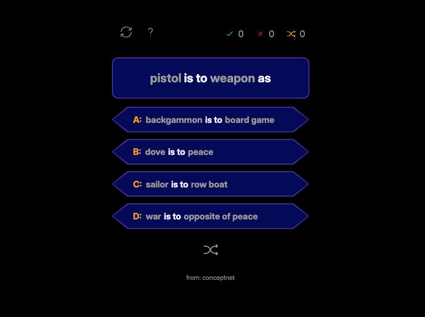

#game
#pwa
#mobile
#202506

# [Apoquerar]()

[Github](https://github.com/rberenguel/apoquerar)
[Play](https://mostlymaths.net/apoquerar)

A version of Zach Gage's Pile up Poker (that you can play in Puzzmo). This is a simplified version I can play "locally".

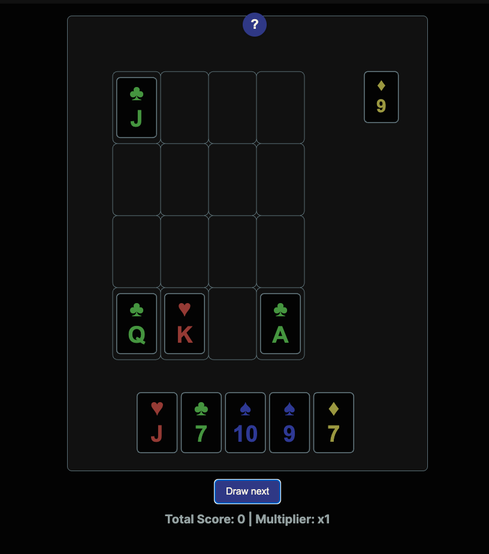

#game
#pwa
#mobile
#202505

# [Pinta]()

[Github](https://github.com/rberenguel/pinta)
[Use](https://mostlymaths.net/pinta)
[Example export](https://rberenguel.github.io/pintes/Slicer-whitepaper.html)
[Video](https://www.youtube.com/watch?v=KDMp6_hqPv0)

Outline editor, written by me and Gemini.

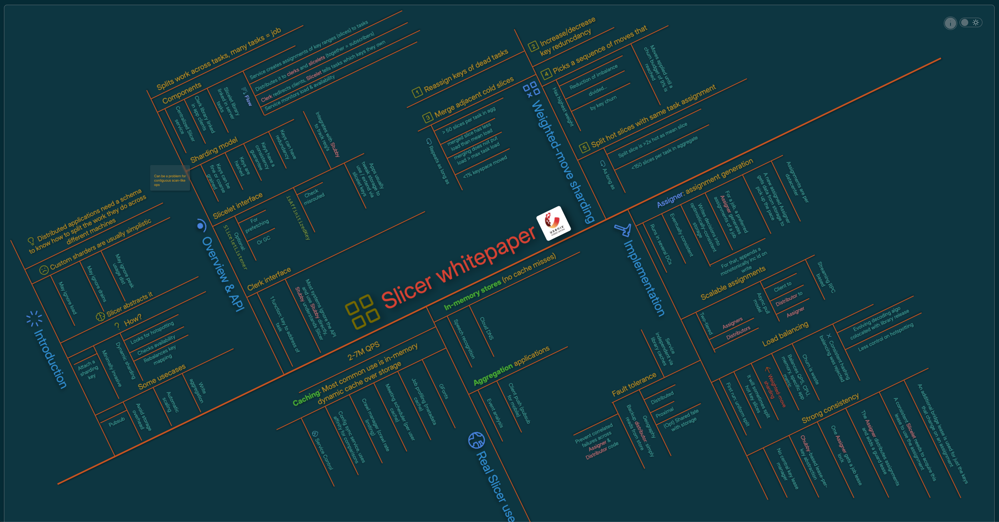

#pwa
#202505

# [Suc]()

[Github](https://github.com/rberenguel/suc)
[Video](https://github.com/rberenguel/suc?tab=readme-ov-file#suc)

Make work less boring.

Explosions on marking as read / archiving in GMail.

Distraction-free blocking of pages, with score. Triple click on the distraction free overlay to remove it.

Tracks your activity across tabs to present you with a full-day view.

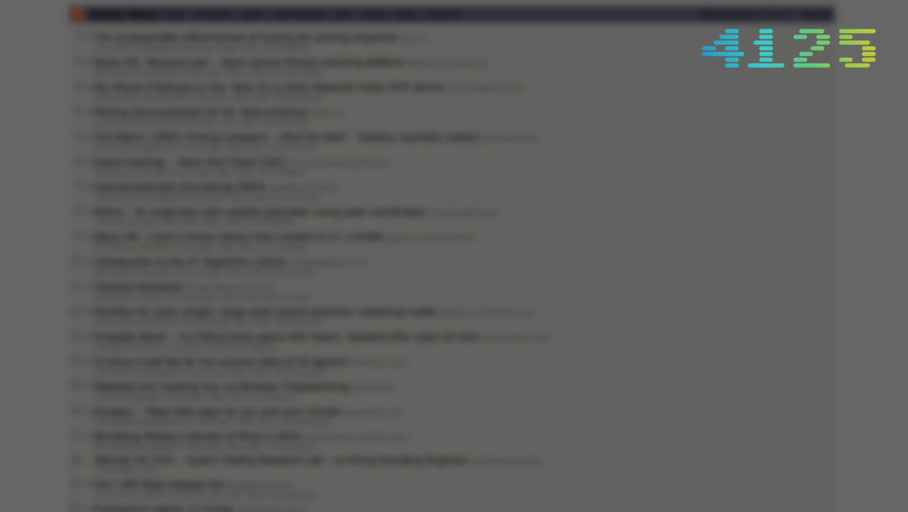

#chrome-extension
#202506

# [Goita]()

[Github](https://github.com/rberenguel/goita)
[Use](https://mostlymaths.net/goita/pwa/)
[Video](https://www.youtube.com/watch?v=Q2RcpPYaHbs)

A Chrome extension to take and annotate screenshots and memes.

Can be used as a standalone PWA, too.

#chrome-extension
#pwa
#wip
#202411

# [Mos]()

[Github](https://github.com/rberenguel/mos)
[Use](https://mostlymaths.net/mos)

Pixel art editor

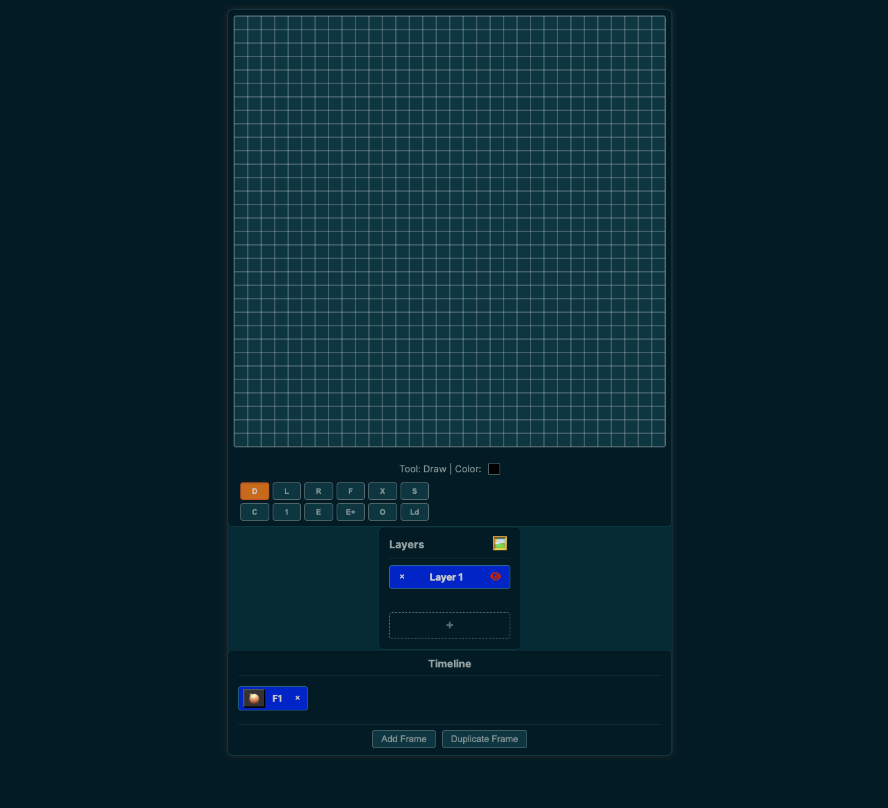

#pwa
#wip
#202505

# [sis]()

[Github](https://github.com/rberenguel/sis)
[Play](https://mostlymaths.net/sis)

Given a dice and several potential cube unfoldings, match the right one.

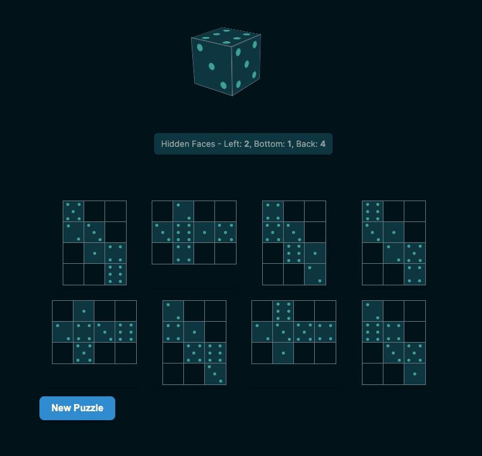

#game
#pwa
#mobile
#202505

# [Garbuix]()

[Github](https://github.com/rberenguel/garbuix)
[Use](https://mostlymaths.net/garbuix)

A live editor for a graphviz-like language (transpiles to dot on the fly), designed to make writing graphs by hand somewhat enjoyable. I use it when drawing concept maps.

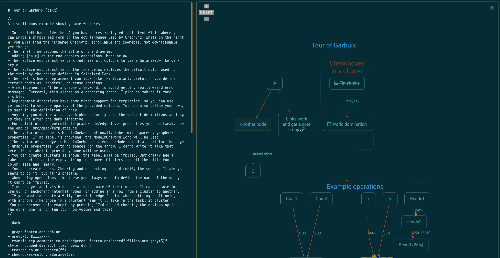

#pwa
#202501

# [Shotgun Pollock]()

[Github](https://github.com/rberenguel/shotgun-pollock)
[Play](https://mostlymaths.net/shotgun-pollock)

I got an idea for a game, and realised Global Game Jam 25 was going to start in 2 days. The theme this year is "Bubbles"… which almost fits the idea I had.

_Paint blobs have invaded the canvas. But you have your shotgun_.

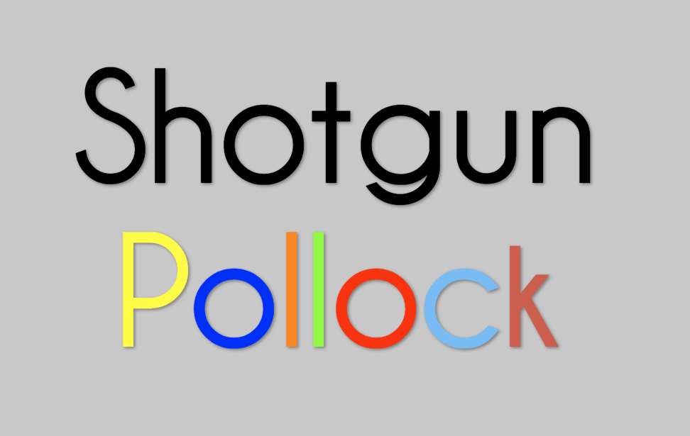

#game
#pwa
#mobile
#202501

# [foowrite]()

[Github](https://github.com/rberenguel/foowrite)
[Video](https://www.youtube.com/watch?v=FT0cgbyiSng)

A distraction-free writing device you can take with you anywhere (as long as you have a Pi Pico with the right screen or want to write a bit of C++). With vim keybindings.

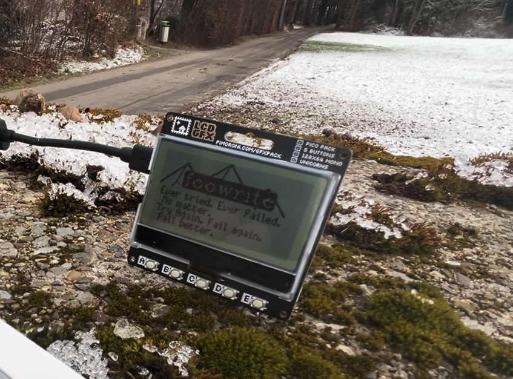

#pico
#202501

# [obsidian-retolador-plugin]()

[Github](https://github.com/rberenguel/obsidian-retolador-plugin)

A modal, keyboard-driven plugin for fast and efficient highlighting in Obsidian.

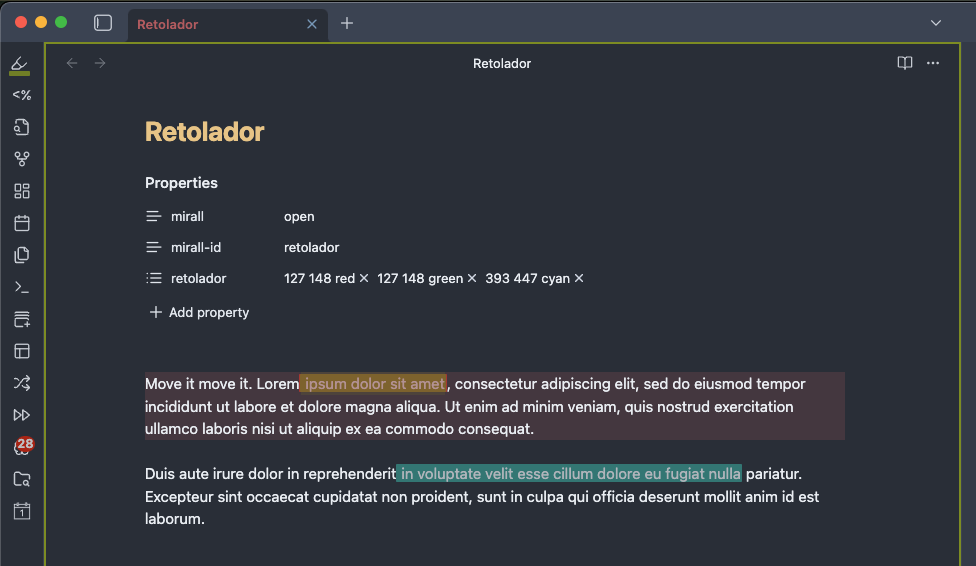

#obsidian
#202508

# [obsidian-nanananana-leader-plugin]()

[Github](https://github.com/rberenguel/obsidian-nanananana-leader-plugin)

An Obsidian plugin that provides a "leader key" to trigger commands, creating a new layer of keyboard shortcuts.

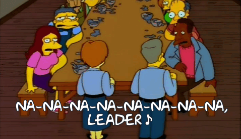

#obsidian
#202508

# [Tafaner]()

[Github](https://github.com/rberenguel/tafaner)

A Chrome extension that can call a local web server when you message yourself in Whatsapp Web.

#chrome-extension
#202508

# [Glof]()

[Github](https://github.com/rberenguel/glof)
[Play](https://mostlymaths.net/glof)

It's like a somewhat famous mobile game I enjoyed. But also different, because I can tweak things around, or add things, or…

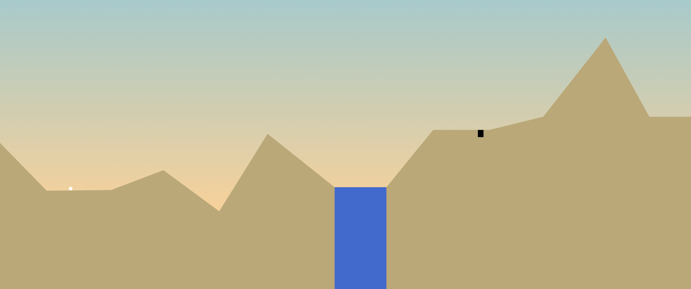

#game
#pwa
#mobile
#wip
#202508

# [obsidian-cambrer-plugin]()

[Github](https://github.com/rberenguel/obsidian-cambrer-plugin)

An Obsidian plugin that serves notes in a local browser. It integrates my MetaP command palette to be able to search notes directly.

#obsidian
#202508

# [Tesseŀla]()

[Github](https://github.com/rberenguel/tessella)
[Use](https://mostlymaths.net/tessella)

A pixel camera offering an array of pixel art palettes to choose from. Needs to be installed as a PWA because the CSS styling requires full-screen.

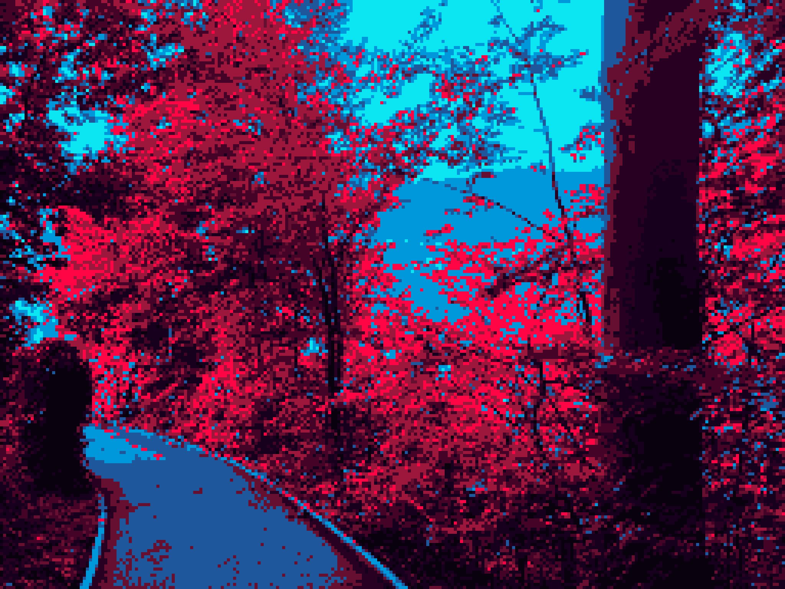

#pwa
#mobile
#202508

# [Pomo]()

[Github](https://github.com/rberenguel/pomo)

A pomodoro timer for the M5Stack Core2, with rotation control.

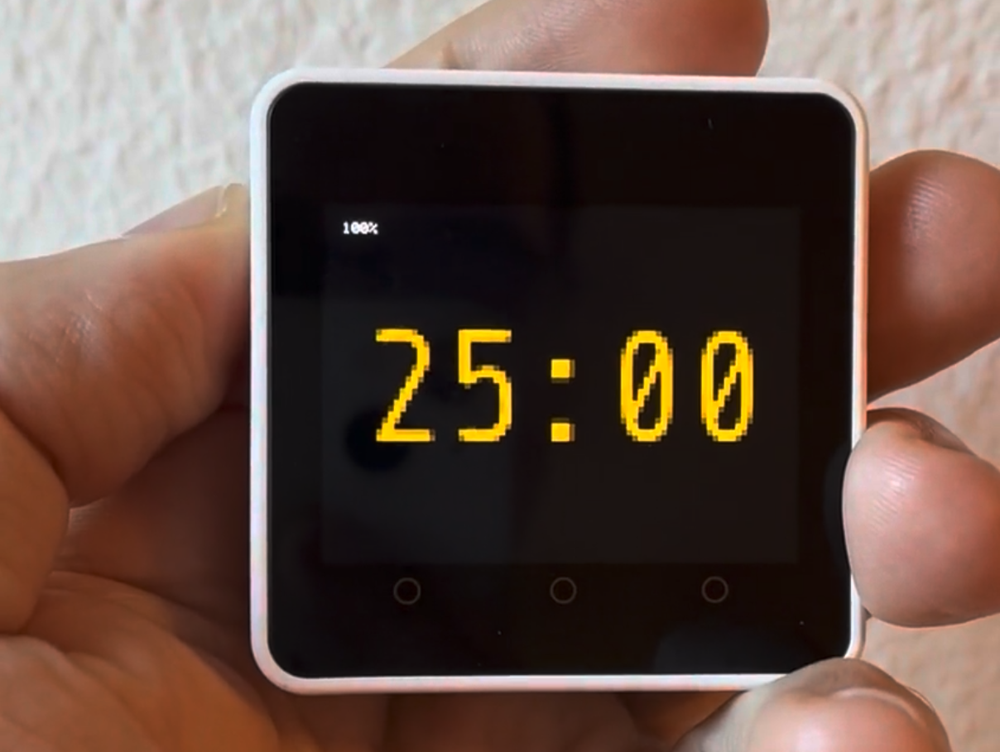

#m5stack
#micropython
#202509

# [Crossfire]()

[Github](https://github.com/rberenguel/crossfire)
[Play](https://mostlymaths.net/crossfire)

A boardgame / turn based version of Destrier, i.e. asteroids + enemies. Includes the board game rules, this is just a playable prototype with a simple AI.

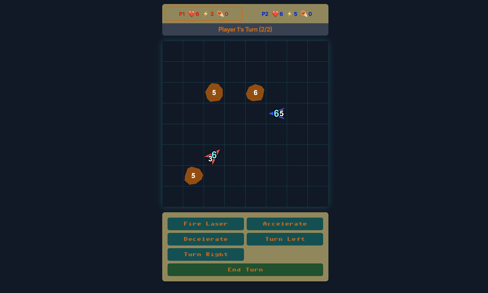

#pwa
#mobile
#game
#202509

# [olivine]()

[Github](https://github.com/rberenguel/olivine)
[Use](https://mostlymaths.net/olivine)

A PWA that lets you open an Obsidian vault and work with it. Started as a Chrome extension, became a VS Code extension and now it is usable as either a standalone PWA (if you have file access in Chrome) or a backend powered PWA (if you need a backend to serve and edit the files, for that you need to clone the repo).

No longer updated, but it provided a lot of good ideas for other projects.

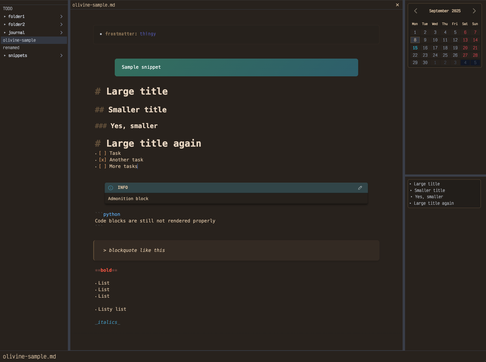

#pwa
#rip
#202509

# [srp]()

[Github](https://github.com/rberenguel/srp)
[Play](https://mostlymaths.net/srp)

A 3D snake game. Best on mobile (it is where the controls make most sense), but it is not easy.

#pwa
#mobile
#game
#202509

# [Drecera]()

[Github](https://github.com/rberenguel/drecera)

A Chrome extension to quickly get Gemini to summarise / read / synthesise tabs, using only the "normal" Gemini web app, no API required, just some copy-pasting.

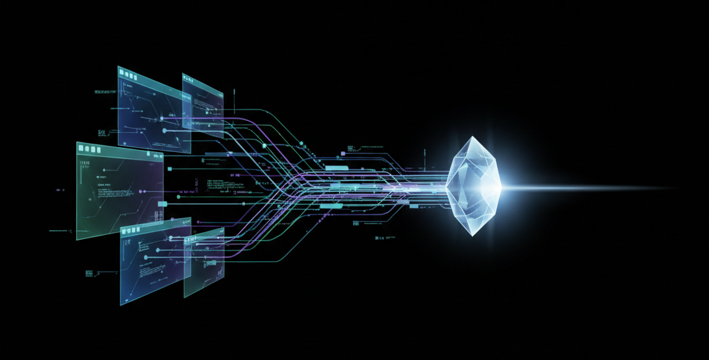

#chrome-extension
#202509

# [hed]()

[Github](https://github.com/rberenguel/hed)
[Video](https://youtu.be/x56SmT67LJw)

A Chrome extension to highlight via regexes any word(s) in a web page, and to edit text efficiently as if using <code>ed</code>.

#chrome-extension
#202509

# [punt]()

[Github](https://github.com/rberenguel/punt)
[Use](https://mostlymaths.net/punt)

Likely the <em>minimalistic-est</em> text editor. You always will have an empty page, editing is via a command palette (where ed-like commands can be issued) and you only can briefly read your document (also using ed-like syntax). Use h to get help.

This became the hed extension, eventually.

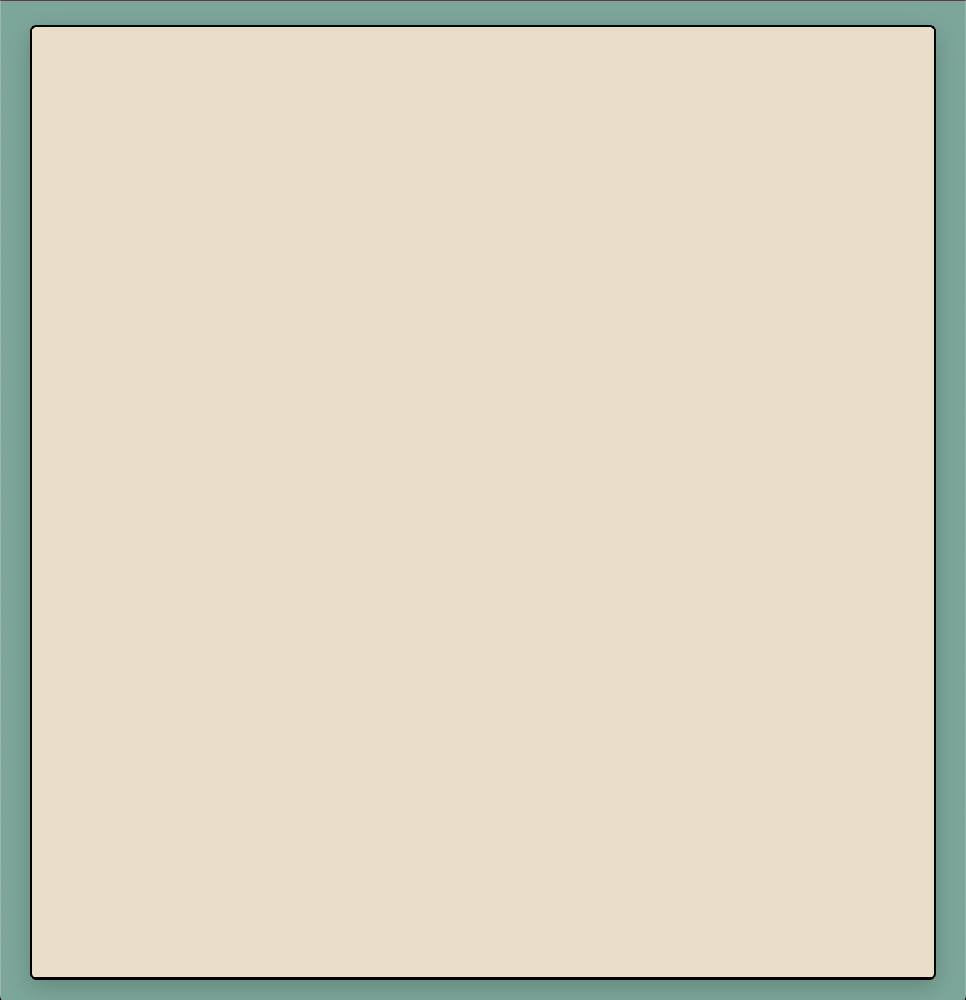

#pwa
#202509

# [totxo]()

[Github](https://github.com/rberenguel/totxo)
[Play](https://mostlymaths.net/totxo)

A 3D breakout game.

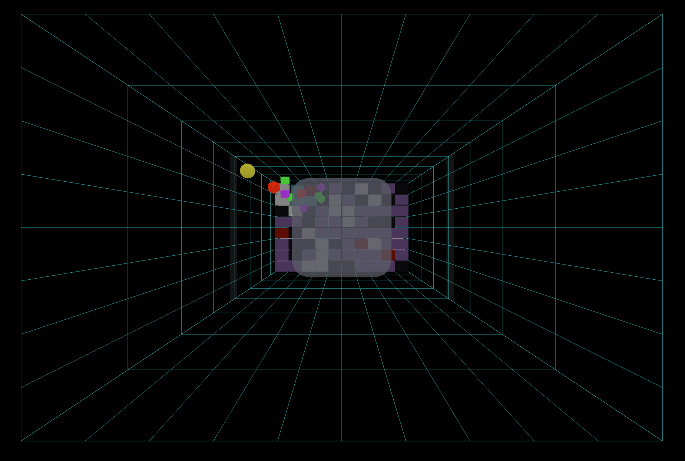

#pwa
#mobile
#game
#202510.0

# [quid]()

[Github](https://github.com/rberenguel/quid)
[Play](https://mostlymaths.net/quid)

A word guessing game based on semantic proximity (similar to <i>Semantle</i>). It can be played in several languages. It is extremely hard in all of them.

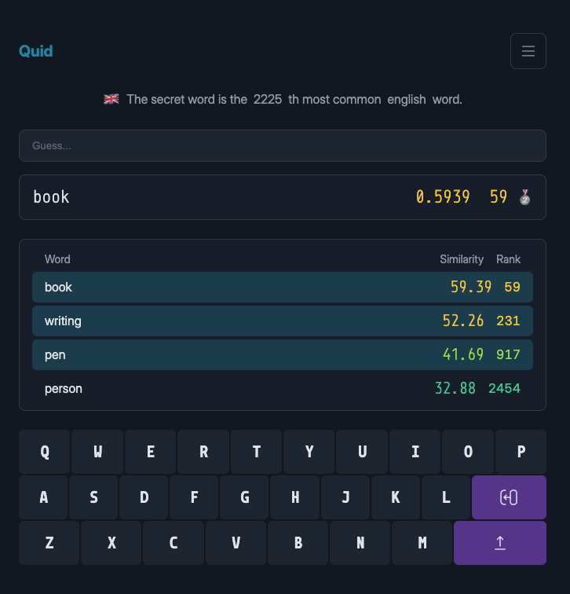

#pwa
#mobile
#game
#202508

# [puja]()

[Github](https://github.com/rberenguel/puja)
[Play](https://mostlymaths.net/puja)

My own take on a classic: stacking blocks. It is a great meditative experience.

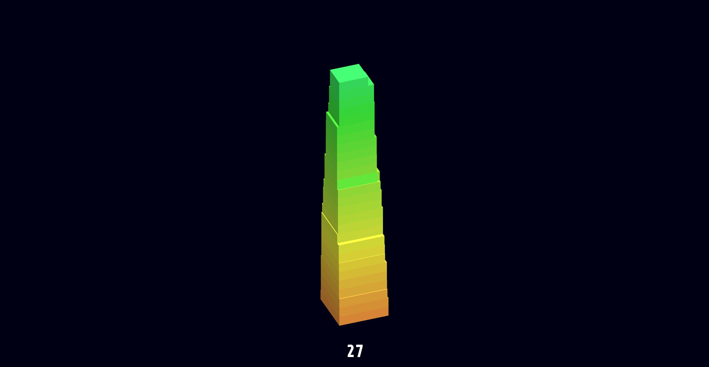

#pwa
#mobile
#game
#202510.1

# [eixut]()

[Github](https://github.com/rberenguel/eixut)
[Play](https://mostlymaths.net/eixut)

I tried replicating <em>Bleak Sword</em>'s touch controls in a slightly different setting. This is (or will be) some sort of random dungeon crawler. Plays best on mobile

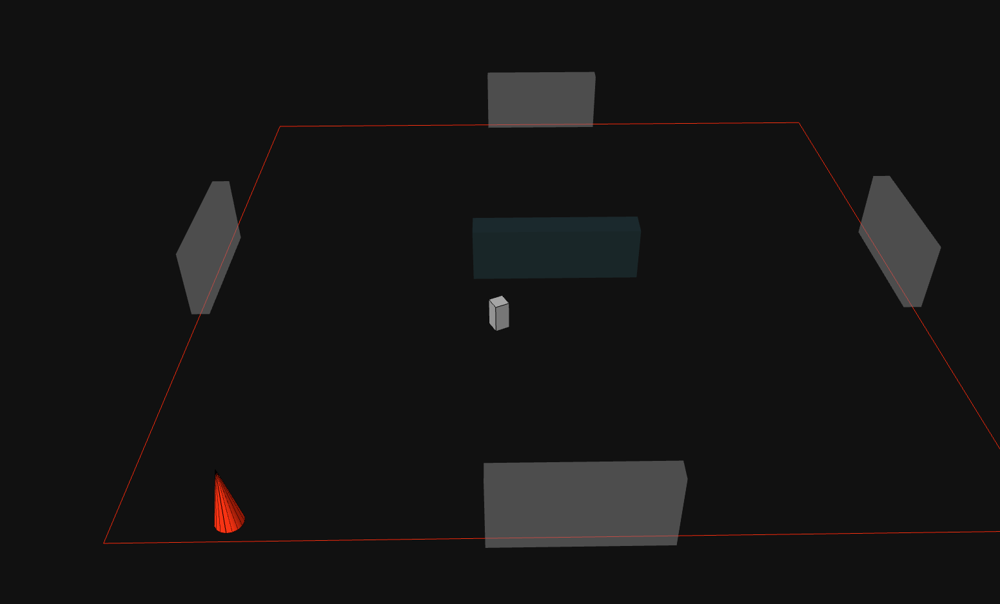

#pwa
#mobile
#game
#202510.2

# [flux]()

[Github](https://github.com/rberenguel/flux)
[Play](https://mostlymaths.net/flux)

A cross between two games.

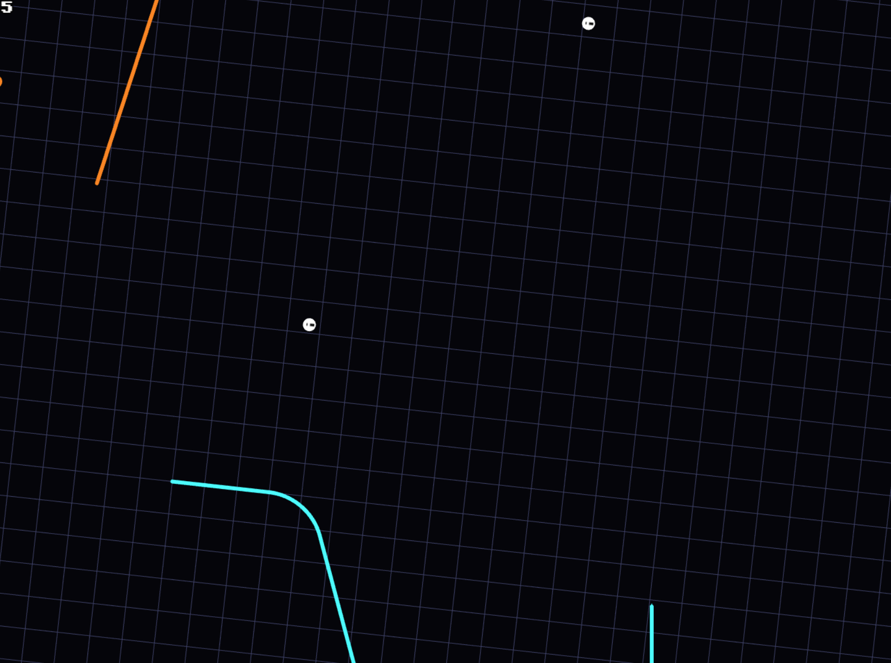

#pwa
#mobile
#game
#202510.3

# [yacme]()

[Github](https://github.com/rberenguel/yacme)
[Use](https://mostlymaths.net/yacme)

Yet Another Concept Map Editor. A concept map editor using my <em>dot-like</em> syntax, but with a D3 backend (unlike Garbuix, which uses a WASM Graphviz backend). Can export to standalone HTML.

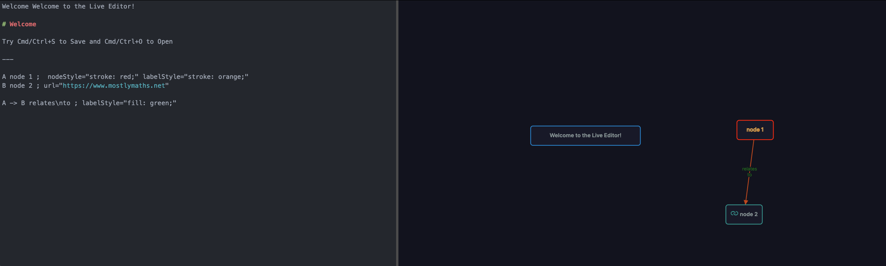

#pwa
#202510.4

# [quadrants]()

[Github](https://github.com/rberenguel/quadrants)
[Use](https://mostlymaths.net/quadrants)

An editor for "quadrants", like an Eisenhower matrix. Or a calendar. Can export to standalone HTML and has print-friendly styles in light mode.

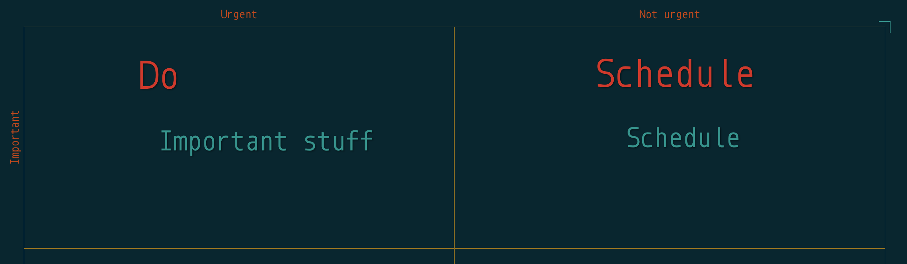

#pwa
#202510.5

# [iconer]()

[Github](https://github.com/rberenguel/misc-pwas/iconer)
[Use](https://mostlymaths.net/misc-pwas/iconer)

A generator of font icons for my Progressive Web Apps. Sometimes I just want <em>an</em> icon so I can make the thing installable. This makes it easier, even though html2canvas is sometimes buggy.

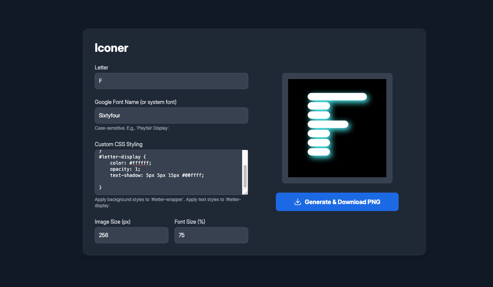

#pwa
#202510.6

# [tong]()

[Github](https://github.com/rberenguel/tong)
[Play](https://mostlymaths.net/tong)
[Video](https://youtu.be/kYTBZxOcavw)

A cross of tennis and Pong that has a SFW name. Still needs work to be playable on mobile.

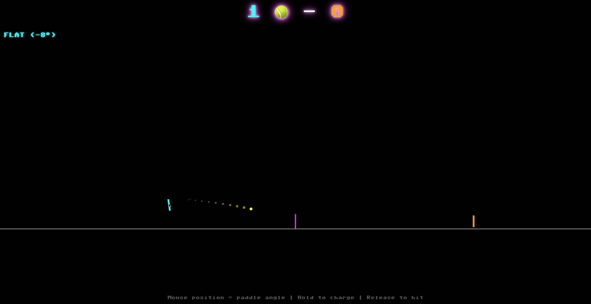

#pwa
#game
#202510.7

# [soro]()

[Github](https://github.com/rberenguel/soro)
[Use](https://mostlymaths.net/soro)

A soroban (abacus) with haptic effects on iPhone (should also have them on Android, but that depends on silent mode). Has also a tutorial to learn.

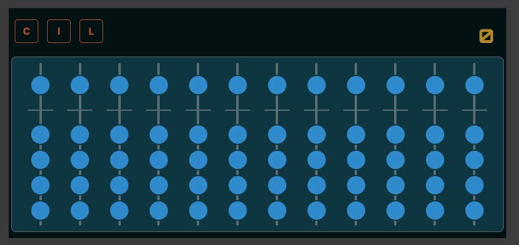

#pwa
#202510.8

# [titola]()

[Github](https://github.com/rberenguel/titola)
[Use](https://mostlymaths.net/titola)

A browser-based tool for adding text and image overlays to GIFs and videos, with per-frame positioning and animation support.

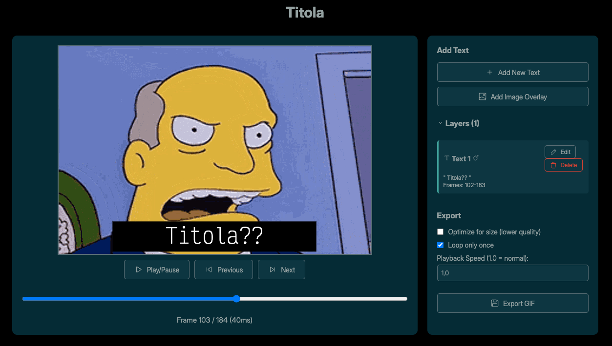

#pwa
#202510.9

# [fluxstream]()

[Github](https://github.com/rberenguel/fluxstream)
[Play](https://mostlymaths.net/fluxstream)

A cross between three games.

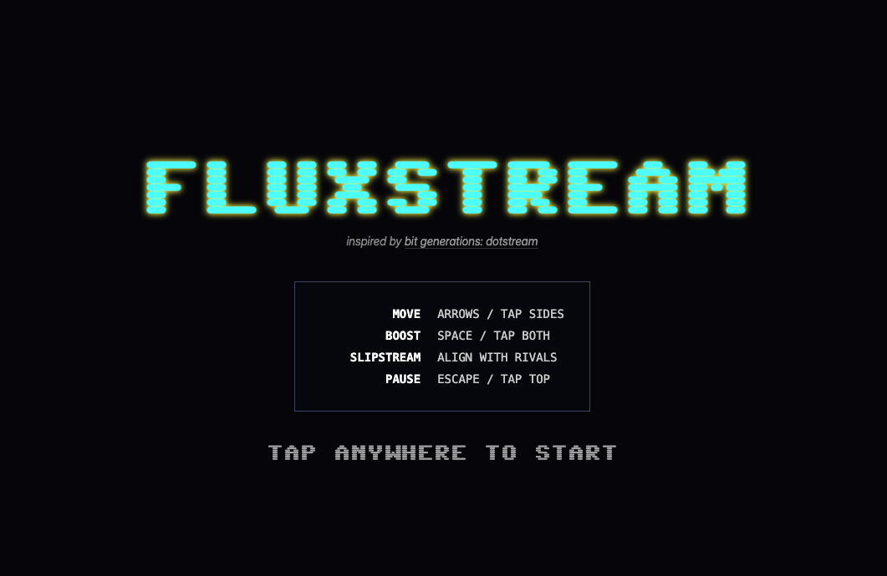

#pwa
#mobile
#game
#202511.0

# [Magrana]()

[Github](https://github.com/rberenguel/magrana)
[Play](https://mostlymaths.net/magrana)

An anagram puzzle, vaguely based on mots.

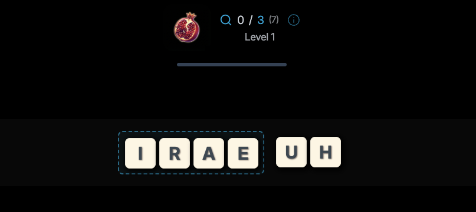

#pwa
#mobile
#game
#202511.1

# [Silence]()

[Github](https://github.com/rberenguel/silence)
[Play](https://mostlymaths.net/silence)

Puzzle game. Cancel noise using destructive interference. It is way harder than it looks.

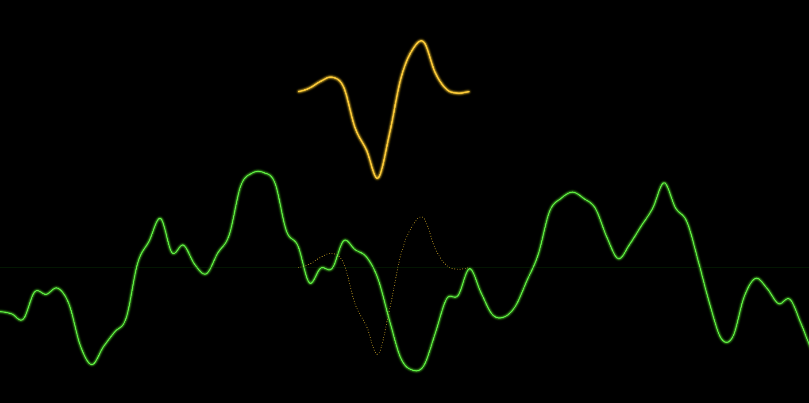

#pwa
#mobile
#game
#202511.2

# [Eink BG]()

[Github](https://github.com/rberenguel/misc-pwas/tree/gh-pages/eink-bg)
[Use](https://mostlymaths.net/misc-pwas/eink-bg)

Prepare images for e-ink displays with pan/zoom/rotate controls, brightness and contrast adjustment, and multiple dithering algorithms (Floyd-Steinberg, Atkinson, Bayer, blue noise). Supports various e-reader formats (XTEINK, Kindle) with portrait/landscape presets. Export as JPG or BMP.

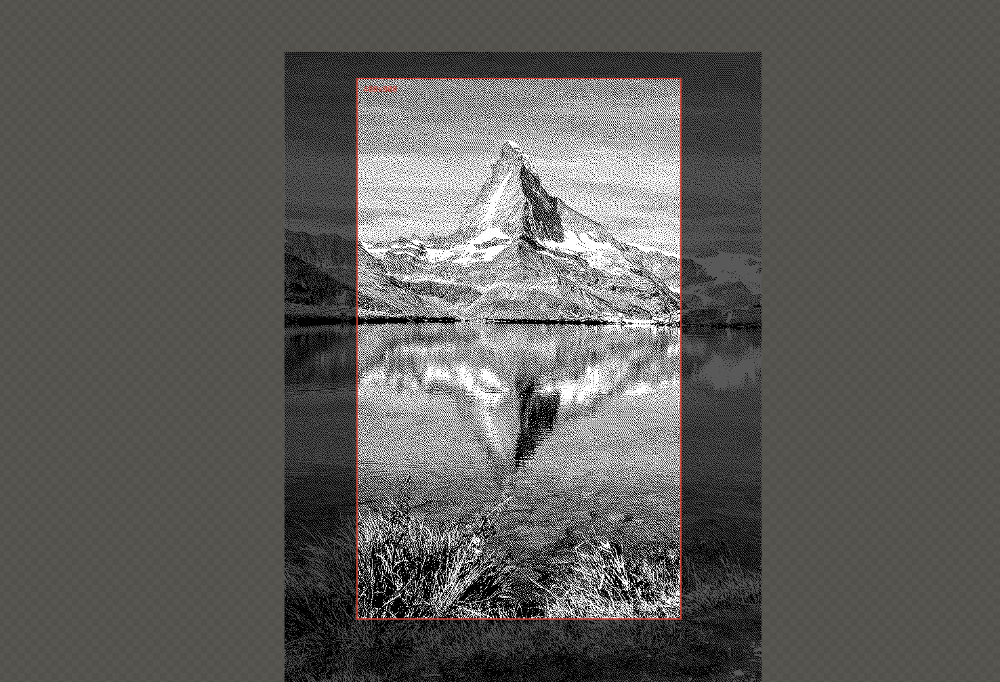

#pwa
#mobile
#202512.0

# [2x4]()

[Github](https://github.com/rberenguel/2x4)
[Use](https://mostlymaths.net/2x4)

A browser-based converter for the Xteink X4 e-reader (480×800). Transforms EPUBs, ArXiv papers, and web articles into optimized XTC/XTH formats with 4-level grayscale and intelligent pagination. Available as both a standalone PWA and Chrome extension for seamless article capture.

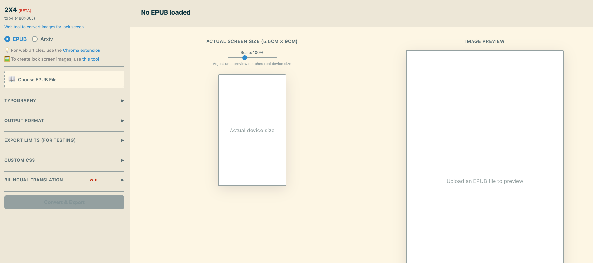

#pwa
#chrome-extension
#202512.1

# [Puzzling]()

[Github](https://github.com/rberenguel/puzzling)
[Play](https://mostlymaths.net/puzzling)

Black and white puzzles you can convert to puzzle books for your Xteink X4 e-reader. Has a maze generator and two logic puzzles.

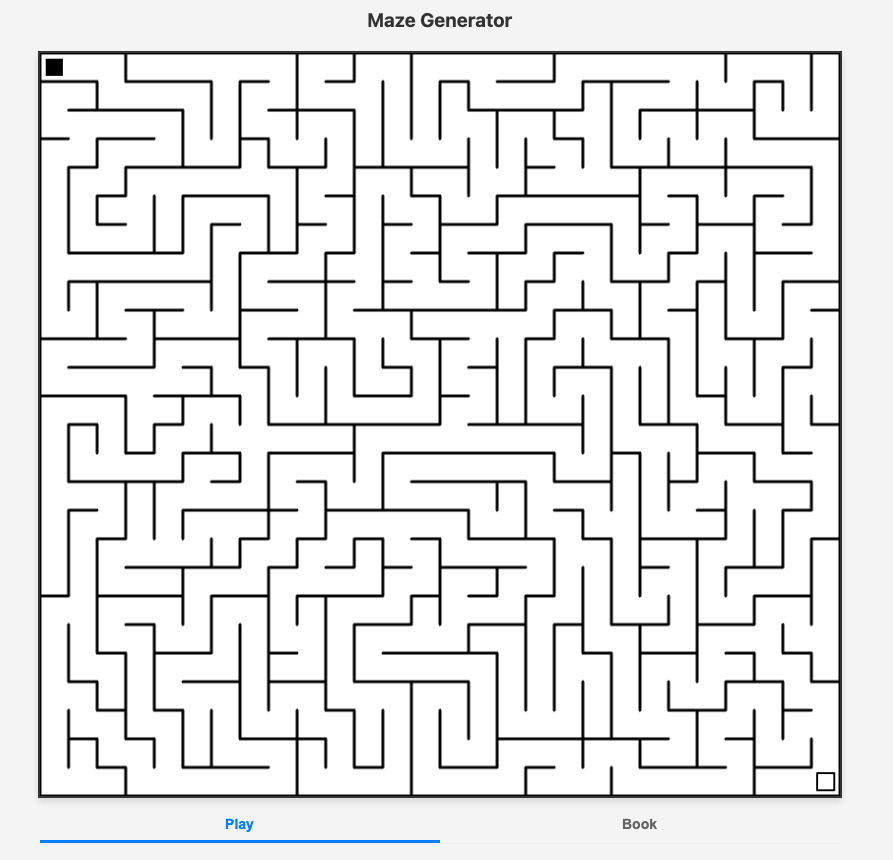

#pwa
#mobile
#game
#202512.2

# [Fiat Lux]()

[Github](https://github.com/rberenguel/fiat-lux)
[Play](https://mostlymaths.net/fiat-lux)

An <a href="https://en.wikipedia.org/wiki/Incremental_game">idle incremental game</a>.

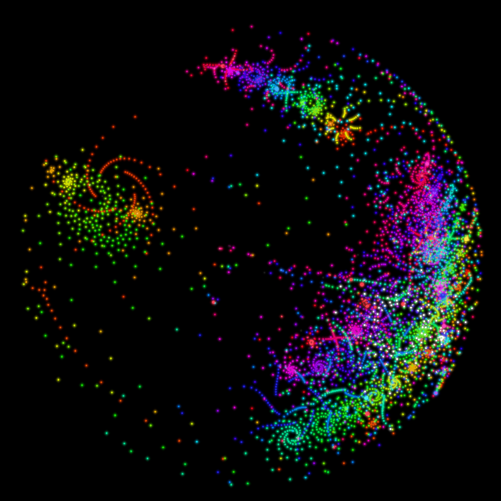

#pwa
#game
#wip
#202512.3

# [Chroma]()

[Github](https://github.com/rberenguel/chroma)
[Play](https://mostlymaths.net/chroma)

Game based on <a href="https://en.wikipedia.org/wiki/Bit_Generations#Coloris">Coloris for the Game Boy Advance</a>

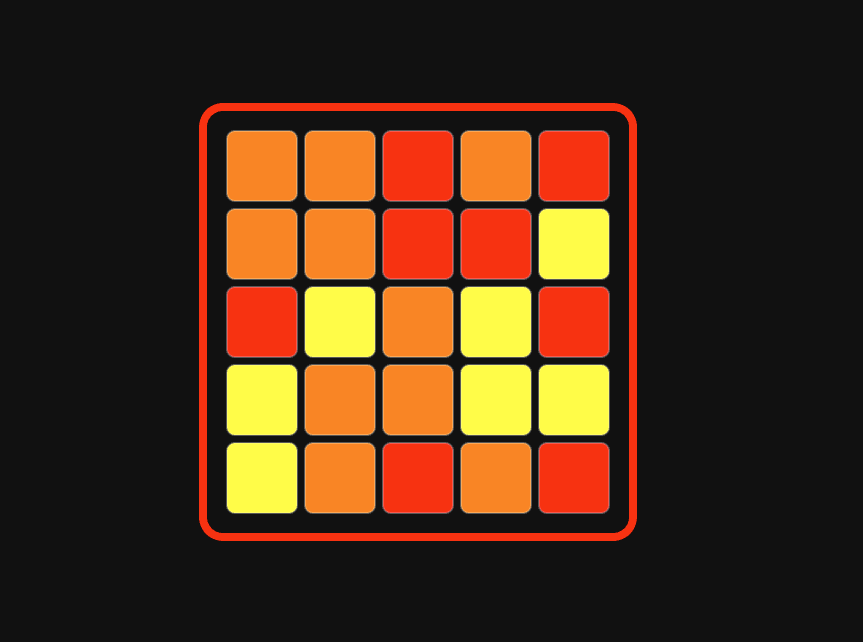

#pwa
#game
#mobile
#202512.4

# [GB2GO]()

[Github](https://github.com/rberenguel/gb2go)
[Use](https://mostlymaths.net/gb2go)

A WIP web-based IDE to write C for the original Gameboy. Has the full build toolchain available on the browser. Still has several missing features

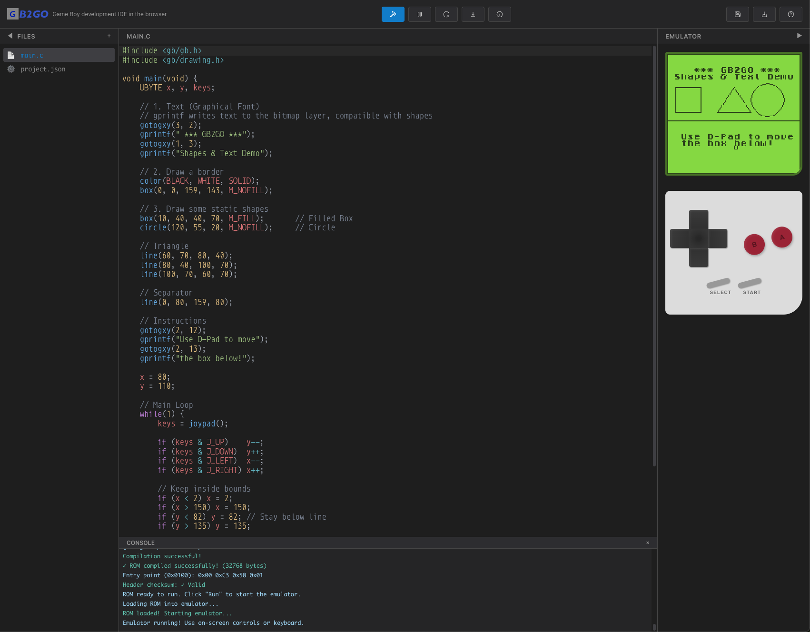

#pwa
#wip
#mobile
#202512.5

# [Tasca]()

[Github](https://github.com/rberenguel/tasca)
[Use](https://mostlymaths.net/tasca)

A PWA inspired by <a href="https://taskwarrior.org/">Taskwarrior</a>, local-only but can sync across devices manually.

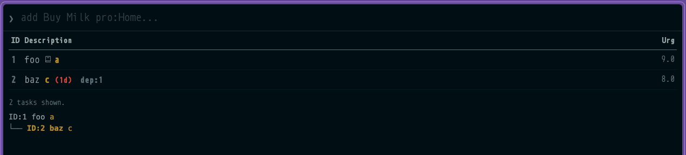

#pwa
#star
#mobile
#202512.6

# [Lloro]()

[Github](https://github.com/rberenguel/lloro)

A Chrome extension that lets you ask questions about the current page via Gemini CLI using the ACP (Agent Client Protocol).

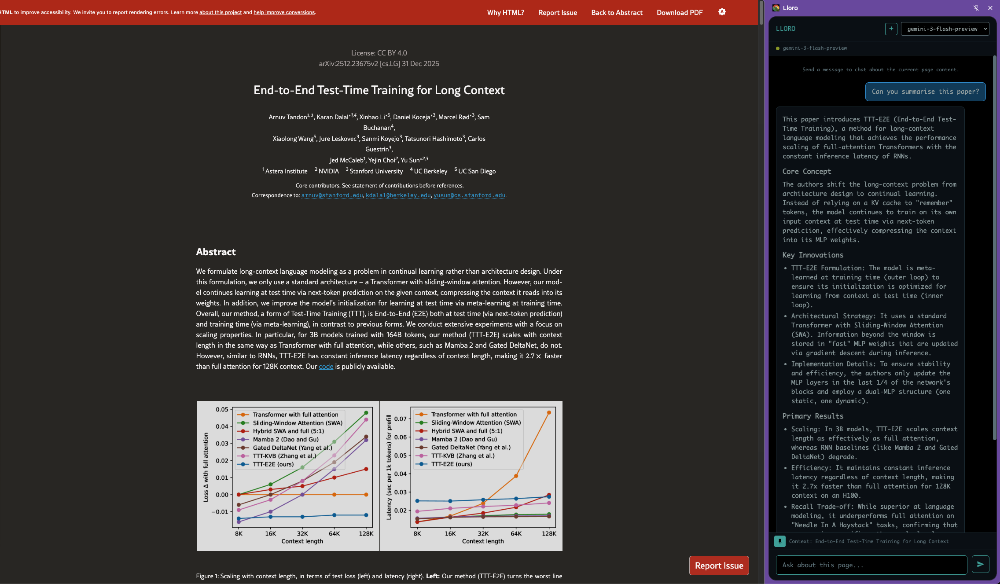

#chrome-extension
#202601.0

# [Trama]()

[Github](https://github.com/rberenguel/trama)
[Use](https://mostlymaths.net/trama)

A PWA heavily inspired by <a href="https://tixy.land/">tixy.land</a> and <a href="https://www.lexaloffle.com/pico-8.php">pico-8</a>. Creative coding and hopefully game prototyping quickly. Very much work in progress, I still need to use it more to see what the rougher edges are. Comes with a couple example games, and has gamepad controls working (and customizable)

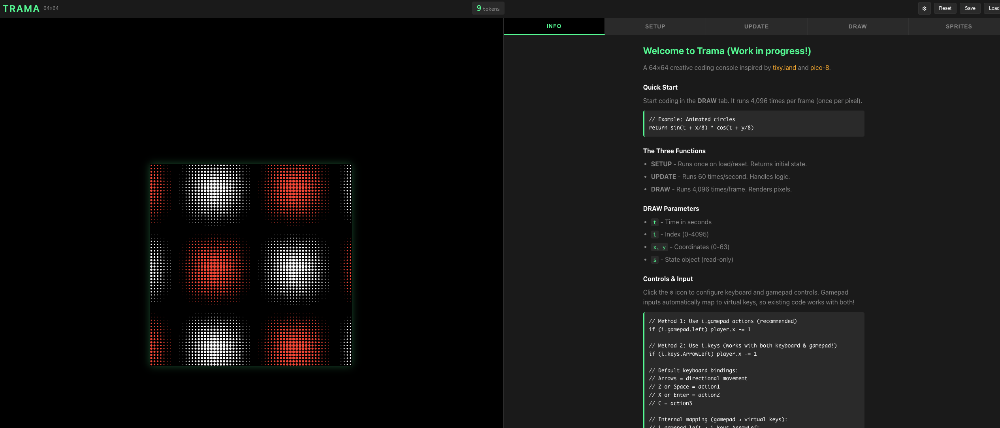

#pwa
#wip
#mobile
#202601.1

# [Titella]()

[Github](https://github.com/rberenguel/titella)

A Chrome extension to automate demo recordings of single page applications. Otherwise it's hard to show Tasca!

#chrome-extension
#202601.2

# [Tanmateix]()

[Github](https://github.com/rberenguel/tanmateix)
[Play](https://mostlymaths.net/tanmateix)

A fast-paced logic puzzle game where you evaluate whether conclusions logically follow from given premises.

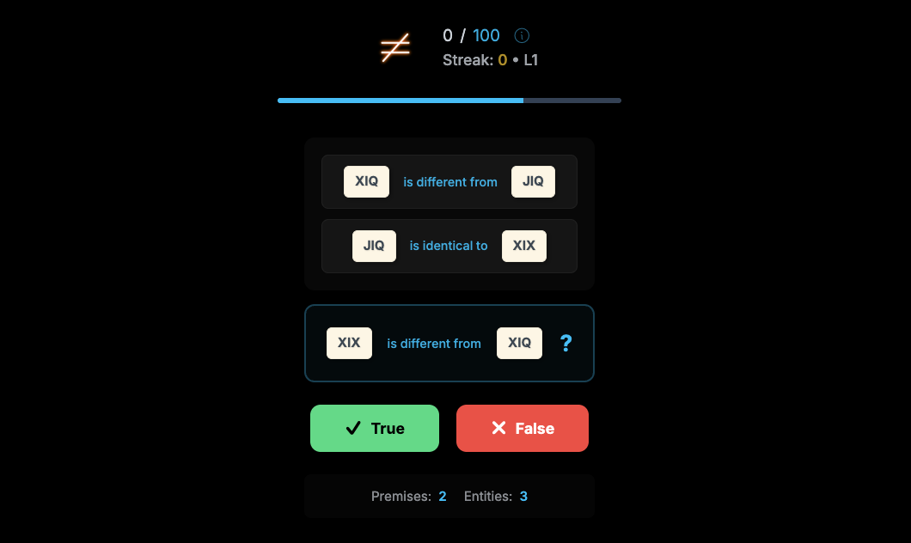

#game
#pwa
#mobile
#202602.0

# [Murder, it wrote]()

[Github](https://github.com/rberenguel/murder-it-wrote)
[Play](https://mostlymaths.net/murder-it-wrote)

A murder mystery generator using an ad-hoc constraint solver.

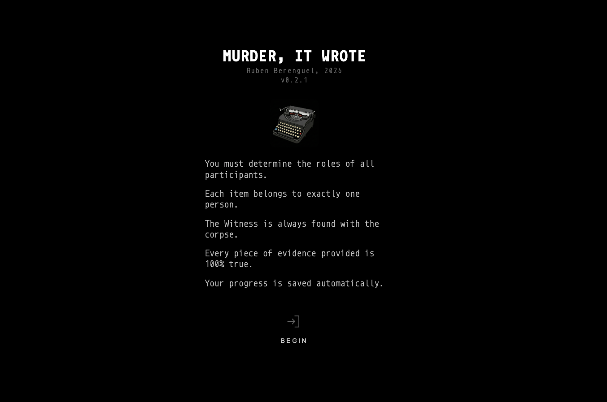

#game
#pwa
#mobile
#202602.1
